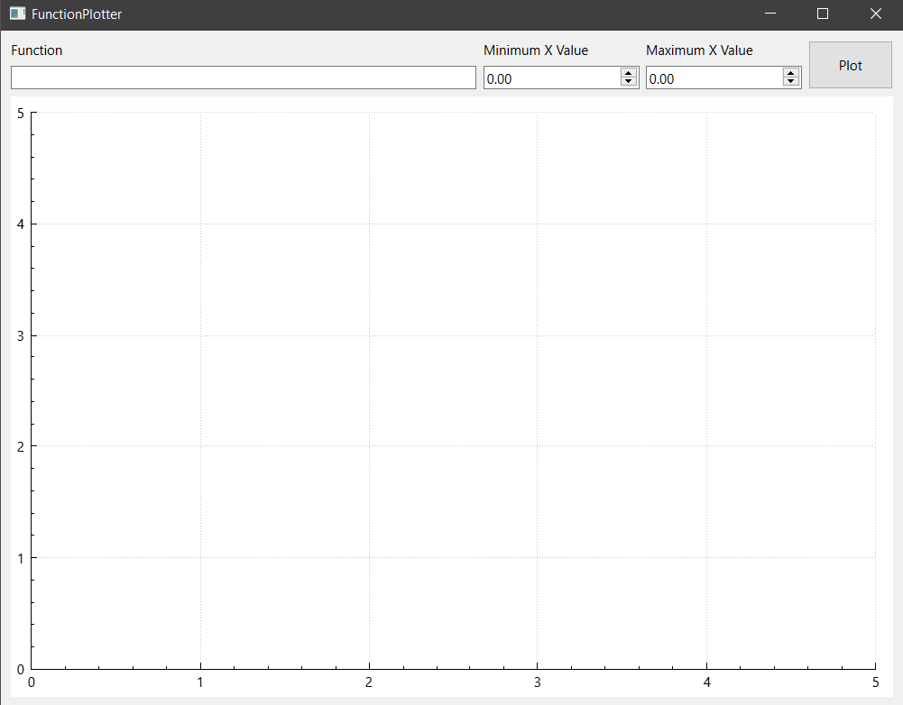
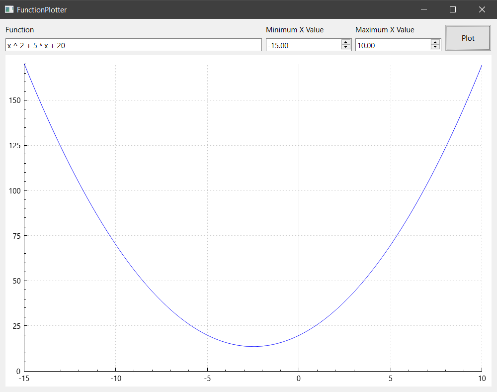

# Function Plotter
## Overview
This is a simple Qt application for plotting functions in x inputted by the user. The project uses an implementation of the **Shunting-Yard algorithm** in order to create a binary tree that contains all the numbers and operators which can then later be parsed for millions of values of x more efficiently than if the string were to be parsed every single time.

The supported operators are:

- \+ (Addition)
- \- (Subtraction)
- \* (Multiplication)
- / (Division)
- ^ (Exponentiation)
## Dependencies
This project only has Qt as a dependency
## Libraries
This project uses the QCustomPlot library for plotting graphs using the calculated data
## Documentation
All methods are documented in their respective header files
## Screenshots
### General Layout

### Correct Inputs

### Incorrect Inputs

